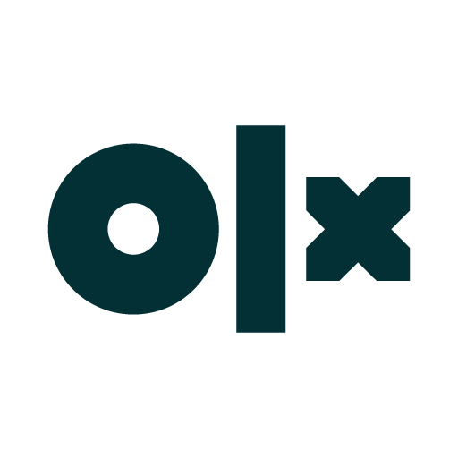

# 🎉olx.com 
- Creating an OLX clone was both a challenging and rewarding project that allowed me to dive deep into modern web development practices. My goal was to replicate the sleek design and intuitive user experience that OLX offers, starting with the foundational elements of any website: the navigation and footer sections.

## This is the project link click this King coffee logo 👇

-  [Navbar Section (Landing page)](https://melodious-dango-a865de.netlify.app/)
-  [Home Section (Landing page)](https://melodious-dango-a865de.netlify.app/)
-  [ Footer](https://neon-gnome-fd0acc.netlify.app/cold-coffee-can)
-  [ car section](https://melodious-dango-a865de.netlify.app/rey2)
-  [ login page](https://melodious-dango-a865de.netlify.app/login)

# 📚 About  olx clone work 
    Working on this project has been a rewarding experience, and I'm proud to share it with my network. I’m excited to continue learning and building upon this foundation, and I look forward to applying these skills in future projects.

>   #Thank you for taking the time to read about my journey. I’d love to hear your thoughts or feedback on my OLX clone!